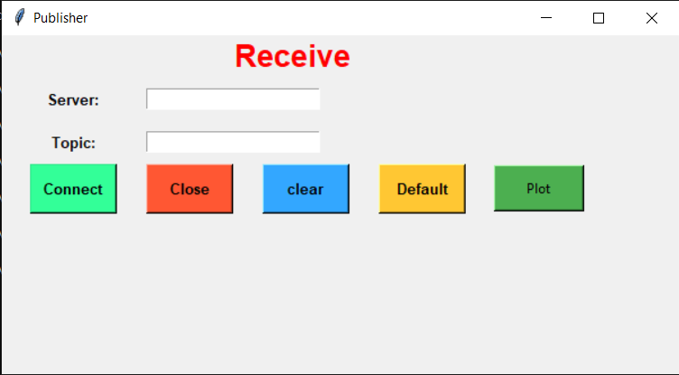
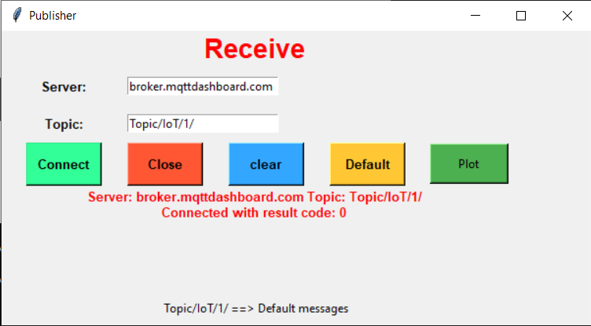

# IoT Dashboard

Two IoT clients one is used to send and the other to receive provided with GUI, coded in python using tkinter, paho and matplotlib.

## Send

### Default button 
Fills default values which are: -

| Entry | Default value |
| ----- | ------------- |
| Server| broker.mqttdashboard.com|
| Topic|Topic/IoT/1/|
| Message|Default messages|

### Clear button
Reset values of Entries

### Close
Terminates the program

### Send 
sends the message

## Receive

### Default button
Fills default values which are: -

| Entry | Default value |
| ----- | ------------- |
| Server| broker.mqttdashboard.com|
| Topic|Topic/IoT/1/|

### Clear button
Reset values of Entries

### Close
Terminates the program

### Connect
Connects to broker

when connected a message appears

### Plots
Plots numeric data received

## Example
When a message received from any connected thing to the same topic it appears in receive window.

